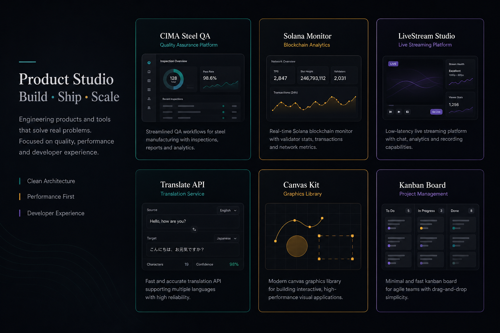
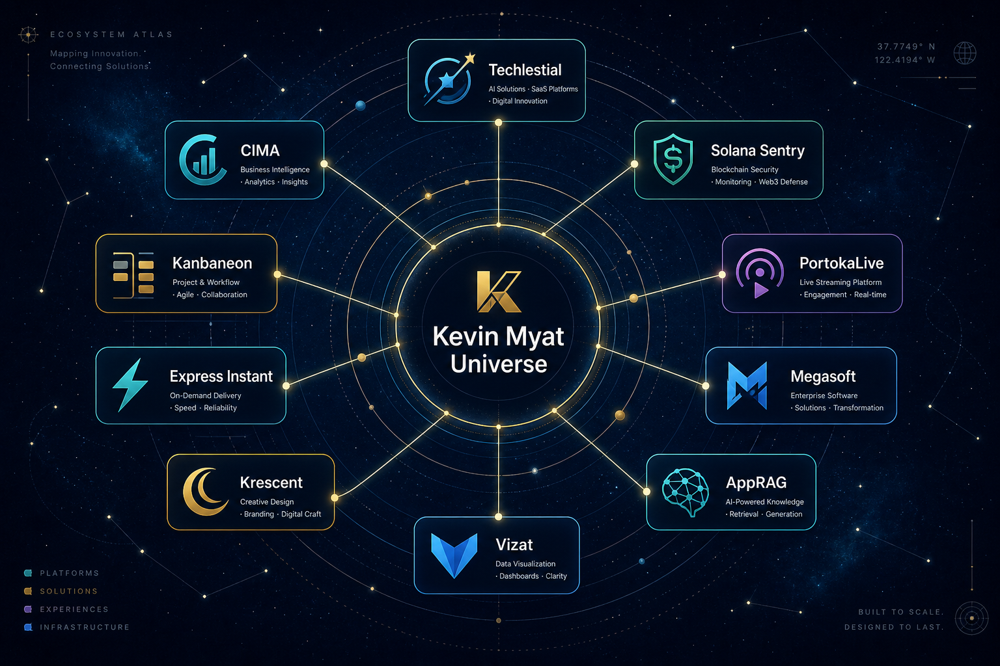

<div align="center">

# Kevin Moe Myint Myat

### Builder · Architect · Product Engineer · Open Source Maintainer

**AI Technology Advisor** designing intelligent systems, modern platforms, and AI-enabled products.

[Professional site](https://kevinmyat.com) · [Engineering Universe](https://kevmoemyintmyat.gitlab.io/nexus/) · [Portfolio](https://kevinmoemyintmyat.vercel.app)

<br />

*This is not a random collection of repositories. This is an actively evolving ecosystem.*

</div>

---

## Start here

| Question | Answer |
|----------|--------|
| **Who** | Kevin Myat — full-stack architect, product engineer, maintainer since 2016 |
| **What** | Flagship apps, developer tools, streaming, games, and AI-era modernization |
| **Active now** | Kanbaneon, CIMA, Solana Sentry, Techlestial libs, PortokaLive, Express Instant |
| **Explore** | [Celestial Nexus](https://kevmoemyintmyat.gitlab.io/nexus/) — live products & demos |
| **Rebirth** | Eternal Flame initiative — landing pages, docs, deploys, npm publishes |

---

## Featured initiatives

<table>
<tr>
<td width="50%" valign="top">

### Eternal Flame

Repository **rebirth** initiative — every project gets a modern landing, `/docs`, CI, and a deploy target.

`AUDIT → REBIRTH → BOY SCOUT → SHIP → MONITOR`

</td>
<td width="50%" valign="top">

### Tree of Life

**Product quality** initiative — browser audits, broken-link scans, ghost-feature reports, and live deploy verification across the portfolio.

</td>
</tr>
<tr>
<td valign="top">

### Constellation Atlas

**Portfolio organization** — org strategy, dependency graphs, ownership audits, and ecosystem mapping across GitHub orgs.

</td>
<td valign="top">

### Celestial Nexus

**Unified product universe** — revived projects index on the [engineering archive](https://kevmoemyintmyat.gitlab.io/nexus/).

</td>
</tr>
<tr>
<td colspan="2" align="center" valign="top">

### Project Mirror

**Identity & presentation layer** — this repository. The GitHub profile is the front door; the Engineering Universe is the city.

</td>
</tr>
</table>

---

## Featured products



<br />

| Product | What it is | Live | Code |
|---------|------------|------|------|
| **CIMA Flame** | Steel delivery QA — field intake to lab testing | [App](https://cima-flame.vercel.app/app/) | [cima](https://github.com/m3yevn/cima) |
| **Solana Sentry** | Solana tx monitoring & webhook verification | [Demo](https://solana-sentry.vercel.app) | [solana-sentry](https://github.com/m3yevn/solana-sentry) |
| **Kanbaneon** | Jira-style Kanban with canvas rendering | [Board](https://kanbaneon.vercel.app) | [kanbaneon](https://github.com/m3yevn/kanbaneon) |
| **PortokaLive** | Open-source live streaming platform | [Web](https://portokalive-web.vercel.app) | [PortokaLive](https://github.com/PortokaLive) |
| **Translatial** | GraphQL translation API on Vercel | [API](https://translatial.vercel.app) | [translatial](https://github.com/techlestial/translatial) |
| **Megasoft Market** | Parody B2B commerce demo | [Landing](https://megasoft-market.vercel.app) | [megasoft-market](https://github.com/m3yevn/megasoft-market) |
| **Vizat** | HTML5 Canvas 2D scene-tree engine | [Playground](https://vizat.vercel.app) | [vizat](https://github.com/m3yevn/vizat) |
| **AppRAG** | README & docs generator CLI | [Site](https://apprag.vercel.app) | [apprag](https://github.com/techlestial/apprag) |
| **Krescent** | Moon buggy runner — Game Off 2020 | [Landing](https://krescent.vercel.app) | [krescent](https://github.com/Krescent-The-Game/krescent) |
| **Express Instant** | JSON-configured Express APIs | [Docs](https://express-instant.vercel.app/docs) | [express-instant](https://github.com/m3yevn/express-instant) |
| **Be A Buddhist** | Sacred audio PWA — routines & player | [App](https://beabuddhist.vercel.app/app/) | [beabuddhist](https://github.com/m3yevn/beabuddhist) |
| **FTP Seer** | Web FTP browser + REST API pair | [Demo](https://ftp-seer-client.vercel.app/demo) | [client](https://github.com/m3yevn/ftp-seer-client) · [api](https://github.com/m3yevn/ftp-seer-api) |

**Techlestial developer tools:** [Gitlestial](https://gitlestial.vercel.app) · [Loglestial](https://loglestial.vercel.app) · [Uilerial](https://uilerial.vercel.app) · [Studio hub](https://techlestial.vercel.app)

---

## Engineering universe



<br />

```
Kevin Myat Universe
├── Techlestial      → npm dev tools (@techlestial/*)
├── CIMA             → industrial QA PWA
├── Solana Sentry    → blockchain monitoring
├── PortokaLive      → live streaming org
├── Megasoft         → commerce demo brand
├── AppRAG           → docs & README CLI
├── Vizat            → canvas 2D engine
├── Krescent         → WebGL game (Game Off 2020)
├── Kanbaneon        → productivity canvas board
├── Express Instant  → low-code Express template
└── Future Projects  → rebirth queue
```

| Destination | URL |
|-------------|-----|
| **Professional advisory** | [kevinmyat.com](https://kevinmyat.com) |
| **Engineering archive** | [kevmoemyintmyat.gitlab.io](https://kevmoemyintmyat.gitlab.io) |
| **Celestial Nexus** | [kevmoemyintmyat.gitlab.io/nexus](https://kevmoemyintmyat.gitlab.io/nexus/) |
| **Wellness portfolio** | [kevinmoemyintmyat.vercel.app](https://kevinmoemyintmyat.vercel.app) |
| **Ecosystem hub** | [kevinmoemyintmyat.vercel.app/ecosystem](https://kevinmoemyintmyat.vercel.app/ecosystem) |
| **Techlestial org** | [github.com/techlestial](https://github.com/techlestial) |
| **PortokaLive org** | [github.com/PortokaLive](https://github.com/PortokaLive) |
| **Deep dive** | [docs/engineering-universe.md](docs/engineering-universe.md) |

---

## Live status

*HTTP verified: 2026-06-16 · [DEPLOYMENT_EVIDENCE](https://github.com/m3yevn/m3yevn/blob/master/docs/engineering-universe.md) in monorepo audit*

### Verified live (production 200)

| Product | URL | Evidence |
|---------|-----|----------|
| Kanbaneon | [kanbaneon.vercel.app](https://kanbaneon.vercel.app) | landing + `/docs` |
| CIMA | [cima-flame.vercel.app/app/](https://cima-flame.vercel.app/app/) | `/api/items` returns demo data |
| Solana Sentry | [solana-sentry.vercel.app](https://solana-sentry.vercel.app) | `/health` → `{"status":"ok"}` |
| FTP Seer | [ftp-seer-client.vercel.app/demo](https://ftp-seer-client.vercel.app/demo) | 60s browse path |
| Celestial Nexus | [kevmoemyintmyat.gitlab.io/nexus](https://kevmoemyintmyat.gitlab.io/nexus/) | universe index |
| Ecosystem mirror | [kevinmoemyintmyat.vercel.app/ecosystem](https://kevinmoemyintmyat.vercel.app/ecosystem) | portfolio hub |

### Broken (verified — not assumptions)

| Product | URL | Status |
|---------|-----|--------|
| Megasoft shop | `/app/` | **404** |
| Krescent play | `/play` | **404** |
| PortokaLive API | portokalive-api.vercel.app | **404** |
| Taxi Finder | taxi-finder-client.vercel.app | **404** |

### Currently reviving

| Project | Focus |
|---------|--------|
| **Megasoft Market** | Fix `/app` shop route · Vue modernization |
| **Krescent** | Playable browser build from legacy Nuxt/Babylon |
| **PortokaLive API** | Deploy verification & API docs |
| **Uilerial** | npm publish pipeline completion |
| **Vizat** | TypeScript rewrite · `@jssuite/vizat` npm wave |

### Recently reborn

| Project | What shipped |
|---------|----------------|
| **CIMA** | Colocated `/api/*` on Vercel · field PWA at `/app/` |
| **Solana Sentry** | Interactive landing demo + docs |
| **Gitlestial & Loglestial** | v2 npm · landing + `/docs` |
| **AppRAG** | Transferred to [techlestial](https://github.com/techlestial/apprag) org |
| **Celestial Nexus** | Universe index on engineering archive |
| **FTP Seer** | Live client demo + API deploys |
| **Operation Show Don't Tell** | Fleet audit docs in personal monorepo |
| **megasoft-market-bff** | GitHub **archived** — API in megasoft-market |

---

## Organizations

| Org | Mission | Hub |
|-----|---------|-----|
| [**m3yevn**](https://github.com/m3yevn) | Flagship products & monorepo experiments | This profile |
| [**techlestial**](https://github.com/techlestial) | Open-source developer tools on npm | [techlestial.vercel.app](https://techlestial.vercel.app) |
| [**PortokaLive**](https://github.com/PortokaLive) | Live streaming — web, API, mobile | [portokalive-web.vercel.app](https://portokalive-web.vercel.app) |
| [**Krescent-The-Game**](https://github.com/Krescent-The-Game) | Game Off 2020 moon buggy | [krescent.vercel.app](https://krescent.vercel.app) |

---

## Connect

<div align="center">

**[kevinmyat.com](https://kevinmyat.com)** · **[LinkedIn](https://www.linkedin.com/in/kevinmoemyintmyat/)** · **[GitLab archive](https://kevmoemyintmyat.gitlab.io)**

<br />

*Project Mirror reflects the entire ecosystem.*

</div>
